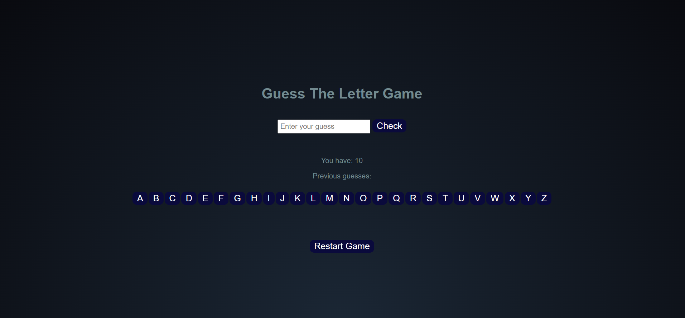

# Game Title
In "Guess the Letter," your challenge is to guess a secret letter chosen by the computer.
The letter is randomly selected from the alphabet, and you have only 10 tries to figure out what it is!

# Getting Started
[Play here!](https://hamzhgg.github.io/Guess-the-Letter-Game/)

Put instructions on how to play the game here

# Attributions
* Put links for Where you got your images from

# Technologies Used
This game was coded using HTML, CSS and Javascript.

# Next Steps
List future improvements:
1. went to  the  univirsity
2. Make my own pusinse
3. Get a softeare engineering fegree
